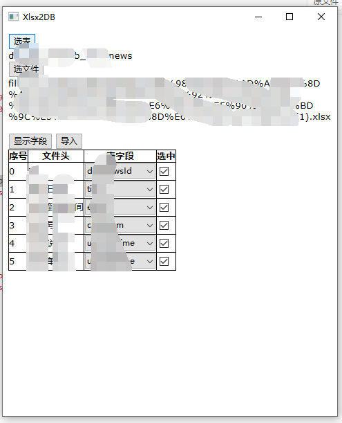
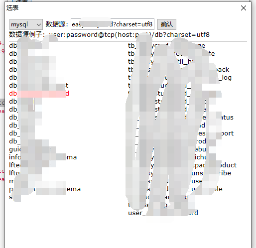

## load xlsx file to db tool

### demo

### support 

- mysql

### download

[windows-64](./package/xlsx2db_64_V2.0.gz)

[windows-32](./package/xlsx2db_32_V2.0.gz)

### todo
 - [x] add chose number when import
 - add button chose all checkbox
 - hide import button when start import
 - add stop button
 
### Window32
 
 - [i686-7.3.0-release-posix-dwarf](https://sourceforge.net/projects/mingw-w64/files/) [link](https://sourceforge.net/projects/mingw-w64/files/Toolchains%20targetting%20Win32/Personal%20Builds/mingw-builds/7.3.0/threads-posix/dwarf/i686-7.3.0-release-posix-dwarf-rt_v5-rev0.7z/download)
 - add MingW to path,modify mingw32-make.exe to make.exe
 
### Window64
 
 - [x86_64-7.3.0-posix-seh](https://sourceforge.net/projects/mingw-w64/files/)
 - add MingW to path,modify mingw32-make.exe to make.exe
 
 
### Linux command in windows Msys1.0 donwload
 - [msys-1.0.10](https://sourceforge.net/projects/mingw/files/MSYS/Base/msys-core/msys-1.0.10/MSYS-1.0.10.exe/download)
 - add to env path
 
 
### About Windows XP (Window32) Version
- Go lib must <= 1.10.7
- Must convert go.mod to vendor use : go mod vendor
- Notice modify some code go:linkname and high api(like Strings.ReplaceAll) 